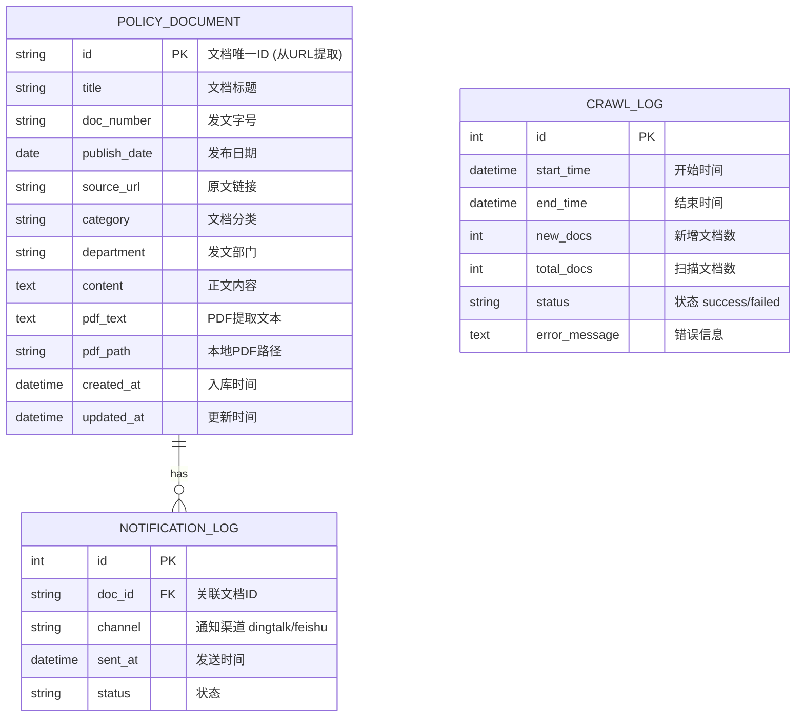

# 教育部政策网站动态爬虫 - 实现计划

## 背景与目标
构建一个自动化爬虫系统，用于：
- 定期监控教育部网站的政策文件发布页面
- 自动检测并下载新发布的政策文件（PDF）
- 解析PDF内容并存入本地SQLite数据库
- 通过钉钉/飞书推送新文件通知
- 支持系统集成与数据分析

## 目标网站分析
通过浏览器研究发现：
- **文档列表页**: `http://www.moe.gov.cn/was5/web/search?channelid=267907`
- **文档详情页**: `http://www.moe.gov.cn/srcsite/A15/moe_778/.../t20241008_1156243.html`
- **页面特点**: 使用JavaScript动态加载，需要使用Playwright处理
- **PDF下载**: 通过JavaScript触发，需模拟点击或解析下载链接

## 用户审核事项
> [!IMPORTANT]
> 请确认以下设计决策：
> - **数据库选择**: 使用 SQLite 作为本地数据库（轻量、无需额外部署）
> - **爬取频率**: 建议每 6小时 检查一次新文件
> - **通知方式**: 优先实现钉钉，飞书作为备选
> - **PDF解析**: 使用 pdfplumber 提取文本内容

## 技术栈
| 组件 | 技术选型 | 说明 |
| :--- | :--- | :--- |
| 语言 | Python 3.10+ | 稳定、生态丰富 |
| 动态爬虫 | Playwright | 处理JavaScript渲染 |
| HTML解析 | BeautifulSoup4 | 灵活的DOM解析 |
| PDF解析 | pdfplumber | 高质量文本提取 |
| 数据库 | SQLite | 轻量本地存储 |
| ORM | SQLAlchemy | 数据库操作抽象 |
| 任务调度 | APScheduler | 定时任务 |
| 配置管理 | PyYAML | YAML配置文件 |
| 日志 | loguru | 简洁强大的日志 |
| 容器化 | Docker | 服务器部署 |

## 数据库设计

### ER图


### 表结构 (SQLite)
```sql
-- 政策文档表
CREATE TABLE policy_document (
    id TEXT PRIMARY KEY,                    -- 文档ID (从URL提取，如 t20241008_1156243)
    title TEXT NOT NULL,                    -- 文档标题
    doc_number TEXT,                        -- 发文字号 (如 教学〔2024〕2号)
    publish_date DATE,                      -- 发布日期
    source_url TEXT NOT NULL,               -- 原文链接
    category TEXT,                          -- 分类 (法规/通知/公告等)
    department TEXT,                        -- 发文部门
    content TEXT,                           -- 网页正文内容
    pdf_text TEXT,                          -- PDF提取的文本
    pdf_path TEXT,                          -- 本地PDF文件路径
    created_at DATETIME DEFAULT CURRENT_TIMESTAMP,
    updated_at DATETIME DEFAULT CURRENT_TIMESTAMP
);

-- 爬取日志表
CREATE TABLE crawl_log (
    id INTEGER PRIMARY KEY AUTOINCREMENT,
    start_time DATETIME NOT NULL,
    end_time DATETIME,
    new_docs INTEGER DEFAULT 0,
    total_docs INTEGER DEFAULT 0,
    status TEXT DEFAULT 'running',          -- running/success/failed
    error_message TEXT
);

-- 通知日志表
CREATE TABLE notification_log (
    id INTEGER PRIMARY KEY AUTOINCREMENT,
    doc_id TEXT NOT NULL,
    channel TEXT NOT NULL,                  -- dingtalk/feishu
    sent_at DATETIME DEFAULT CURRENT_TIMESTAMP,
    status TEXT NOT NULL,                   -- success/failed
    response TEXT,
    FOREIGN KEY (doc_id) REFERENCES policy_document(id)
);

-- 索引
CREATE INDEX idx_doc_publish_date ON policy_document(publish_date);
CREATE INDEX idx_doc_category ON policy_document(category);
CREATE INDEX idx_crawl_start ON crawl_log(start_time);
```

## 项目结构
```text
Dynamic crawler/
├── config/
│   ├── settings.yaml           # 全局配置
│   └── sites.yaml              # 目标网站配置
├── src/
│   ├── __init__.py
│   ├── core/
│   │   ├── __init__.py
│   │   ├── crawler.py          # 爬虫核心引擎
│   │   ├── parser.py           # HTML解析器
│   │   ├── pdf_parser.py       # PDF解析器
│   │   └── detector.py         # 变化检测器
│   ├── storage/
│   │   ├── __init__.py
│   │   ├── database.py         # 数据库连接管理
│   │   └── models.py           # SQLAlchemy模型
│   ├── scheduler/
│   │   ├── __init__.py
│   │   └── scheduler.py        # 定时任务调度
│   ├── notifier/
│   │   ├── __init__.py
│   │   ├── dingtalk.py         # 钉钉通知
│   │   └── feishu.py           # 飞书通知
│   └── utils/
│       ├── __init__.py
│       ├── logger.py           # 日志配置
│       └── helpers.py          # 工具函数
├── data/
│   ├── db/                     # SQLite数据库文件
│   └── downloads/              # PDF下载目录
├── logs/                       # 日志文件
├── tests/
│   ├── __init__.py
│   ├── test_crawler.py
│   ├── test_parser.py
│   └── test_database.py
├── main.py                     # 主入口
├── requirements.txt            # Python依赖
├── Dockerfile                  # Docker镜像
├── docker-compose.yaml         # 容器编排
└── README.md                   # 项目文档
```

## 核心模块设计

### 1. 爬虫引擎 (crawler.py)
```python
# 伪代码示意
class MOECrawler:
    def __init__(self, config):
        self.browser = None  # Playwright browser
        
    async def fetch_document_list(self, page_num=1):
        """获取文档列表页"""
        # 访问搜索页面
        # 解析文档列表
        # 返回 [{id, title, url, date}, ...]
        
    async def fetch_document_detail(self, doc_url):
        """获取文档详情"""
        # 访问详情页
        # 解析正文、发文字号、PDF链接等
        
    async def download_pdf(self, pdf_url, save_path):
        """下载PDF文件"""
```

### 2. 变化检测 (detector.py)
```python
class ChangeDetector:
    def __init__(self, db_session):
        self.db = db_session
        
    def get_new_documents(self, doc_list):
        """对比数据库，返回新文档列表"""
        existing_ids = self.db.get_all_doc_ids()
        return [doc for doc in doc_list if doc['id'] not in existing_ids]
```

### 3. PDF解析 (pdf_parser.py)
```python
class PDFParser:
    def extract_text(self, pdf_path):
        """从PDF提取文本"""
        import pdfplumber
        text = ""
        with pdfplumber.open(pdf_path) as pdf:
            for page in pdf.pages:
                text += page.extract_text() or ""
        return text
```

## 配置文件设计 (config/settings.yaml)
```yaml
# 爬虫配置
crawler:
  headless: true                    # 无头浏览器模式
  timeout: 30000                    # 页面超时(ms)
  retry_times: 3                    # 重试次数
  retry_delay: 5                    # 重试间隔(秒)

# 调度配置
scheduler:
  interval_hours: 6                 # 爬取间隔(小时)
  max_pages: 5                      # 每次最多爬取页数

# 数据库配置
database:
  path: "./data/db/moe_policy.db"

# 下载配置
download:
  pdf_dir: "./data/downloads"
  max_file_size_mb: 50

# 通知配置
notification:
  enabled: true
  channels:
    - dingtalk                      # 启用的通知渠道

# 钉钉配置
dingtalk:
  webhook_url: "${DINGTALK_WEBHOOK_URL}"  # 从环境变量读取
  secret: "${DINGTALK_SECRET}"            # 加签密钥(可选)

# 飞书配置
feishu:
  webhook_url: "${FEISHU_WEBHOOK_URL}"
```

## 部署方案

### Dockerfile
```dockerfile
FROM python:3.10-slim

# 安装Playwright依赖
RUN apt-get update && apt-get install -y \
    libnss3 libatk1.0-0 libatk-bridge2.0-0 \
    libcups2 libdrm2 libxkbcommon0 libxcomposite1 \
    libxdamage1 libxrandr2 libgbm1 libasound2 \
    && rm -rf /var/lib/apt/lists/*

WORKDIR /app
COPY requirements.txt .
RUN pip install --no-cache-dir -r requirements.txt
RUN playwright install chromium

COPY . .
CMD ["python", "main.py"]
```

## 验证计划 (Verification Plan)

### 自动化测试
```bash
# 运行所有单元测试
pytest tests/ -v
# 测试数据库操作
pytest tests/test_database.py -v
# 测试解析器
pytest tests/test_parser.py -v
```

### 手动验证步骤
1. **基础爬取测试**
   - 运行单次爬取: `python main.py --once`
   - 验证: 检查 PDF 是否下载，数据库是否有记录。
2. **通知测试**
   - 发送测试消息: `python -m src.notifier.dingtalk --test`
3. **Docker部署测试**
   - `docker-compose up --build`

## 实施顺序
1. 项目结构 + 配置管理 + 日志 (30min)
2. 数据库模型 + 初始化 (30min)
3. 核心爬虫 (Playwright) (1h)
4. HTML解析器 + PDF下载 (45min)
5. PDF文本提取 (30min)
6. 变化检测 + 数据存储 (30min)
7. 定时调度器 (30min)
8. 钉钉/飞书通知 (50min)
9. Docker容器化 (30min)
10. 测试 + 调试 (1h)
